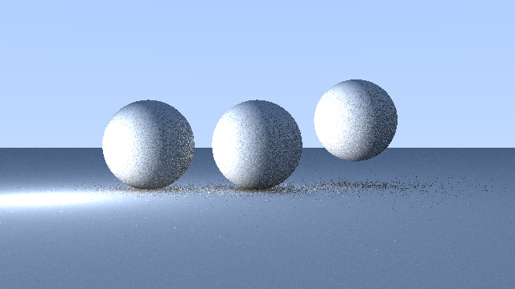
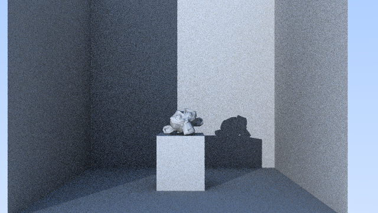

# Raytracer

A raytracer built in Haskell.

## 🚀 Usage

Run the raytracer with:

```bash
cabal run raytracer <config-file.json>
```

The config file lets you customize:

- Resolution & sampling
- Camera & scene setup
- Lighting
- Raytracer settings (e.g. BVH, Russian Roulette)

## 📚 Chapters

This project is documented as a progressive journey. The steps are grouped in own files:

1. [Creating the Image](./docs/01_image.md) - Basic PPM output & gradients
2. [Progress Bar](./docs/02_progress_bar.md) - Rendering feedback & performance tracking
3. [Vec3 Module](./docs/03_vec3.md) - First vector operations and math foundations
4. [Drawing a Circle](./docs/04_circle.md) - First shape before proper ray-sphere logic
5. [The Ray Module](./docs/05_ray.md) - Definition of rays and ray evaluation
6. [Adding a Camera](./docs/06_camera.md) - Camera and background gradient
7. [Sphere Intersection](./docs/07_sphere.md) - Algebra and rendering a sphere
8. [Surface Normals & Perspective Projection](./docs/08_normals_and_perspective.md) - Visualization of normals and perspective
9. [Ray-Sphere Simplification & Profiling](./docs/09_simplifications_and_profiling.md) - Simplyfing the ray-sphere intersection and profiling the Raytracer
10. [Hittable Abstraction](./docs/10_hittable_abstraction.md) - Polymorphism for objects
11. [Multiple Objects](./docs/11_multiple_objects.md) - Scene with many spheres
12. [Fixing Perspective](./docs/12_fixing_perspective.md) - Distortion & focal length
13. [Front vs Back Faces](./docs/13_front_vs_backfaces.md) - Handling ray-side normal direction
14. [Anti-Aliasing](./docs/14_anti_aliasing.md) - Reducing jagged edges
15. [Diffuse Materials](./docs/15_diffuse_materials.md) - (WIP) Lambertian surfaces
16. [Buffered Writing](./docs/16_buffered_writing.md) - Optimizing memory usage
17. [Config Files](./docs/17_config_files.md) - Switching from CLI args to JSON configs
18. [Optimizations](./docs/18_optimizations.md) - Russian Roulette, .OBJ import
19. [Monkey Render](./docs/19_monkey_render.md) - Rendering Blender monkey with triangles
20. [BVH (Bounding Volume Hierarchy)](./docs/20_bvh.md) - Huge speedup via spatial acceleration

## 🖼️ Render Gallery

<div align="center">

<table>
  <tr>
    <td align="center" width="33%">
      <br/>
      <sub>Shadows in a 988 triangles scene. 640x360, AA-10</sub>
    </td>
    <td align="center" width="33%">
      <br/>
      <sub>Shadows in a 988 triangles scene. 1920x1080, AA-50</sub>
    </td>
    <td align="center" width="33%">
      <br/>
      <sub>Shadows in a 63,432 triangles scene. 1920x1080, AA-100</sub>
    </td>
  </tr>
  <tr>
    <td align="center" width="33%">
      <br/>
      <sub>Shadows in a 988 triangles scene. 640x360, AA-10</sub>
    </td>
    <td align="center" width="33%">
      <br/>
      <sub>Shadows in a 988 triangles scene. 1920x1080, AA-50</sub>
    </td>
    <td align="center" width="33%">
      <br/>
      <sub>Shadows in a 63,432 triangles scene. 1920x1080, AA-100</sub>
    </td>
  </tr>
</table>

</div>

## Todo's

- Create multiple lights for each light source to have soft shadows (configurable in config)
-For each lightsource, make sure intensity isnt too high causing surfaces to get completely white very quickly.
- Smoothing (3 normals per triangle, so that triangle surfaces look smoother between triangles)
- Reflections on (e.g. metallic) surfaces 
- Refractions through surfaces like glass