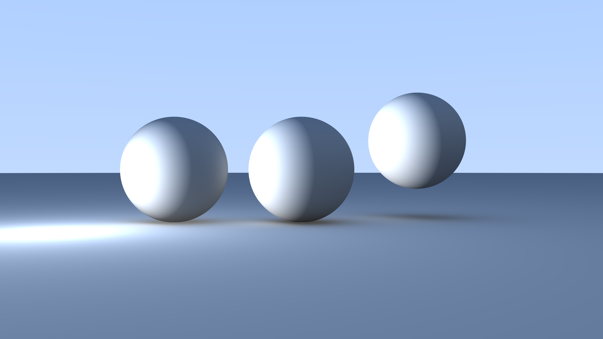
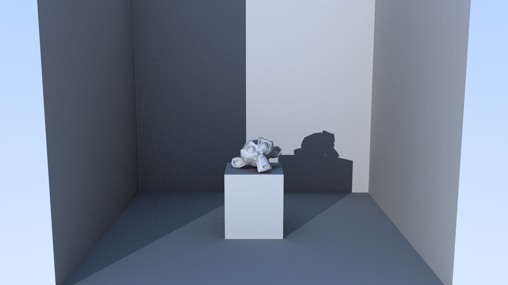
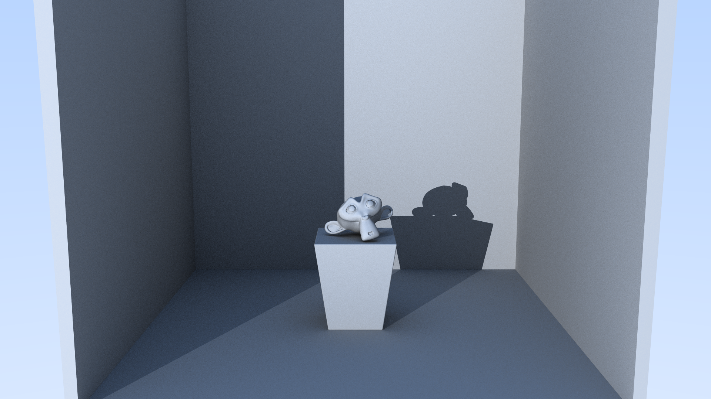

# Raytracer

A raytracer built in Haskell.

## 🚀 Usage

Run the raytracer with:

```bash
cabal run raytracer <config-file.json> +RTS -N24 -qg -A64M -T -RTS
```

But CAUTION! You might want to adjust the hardware parameters for multithreading depending on your system's HW.

The config file lets you customize:

- Resolution & sampling
- Camera & scene setup
- Lighting
- Raytracer settings (e.g. BVH)

## 📚 Chapters

This project is documented as a progressive journey. The steps are grouped in own files:

1. [Creating the Image](./docs/01_image.md) - Basic PPM output & gradients
2. [Progress Bar](./docs/02_progress_bar.md) - Rendering feedback & performance tracking
3. [Vec3 Module](./docs/03_vec3.md) - First vector operations and math foundations
4. [Drawing a Circle](./docs/04_circle.md) - First shape before proper ray-sphere logic
5. [The Ray Module](./docs/05_ray.md) - Definition of rays and ray evaluation
6. [Adding a Camera](./docs/06_camera.md) - Camera and background gradient
7. [Sphere Intersection](./docs/07_sphere.md) - Algebra and rendering a sphere
8. [Surface Normals & Perspective Projection](./docs/08_normals_and_perspective.md) - Visualization of normals and perspective
9. [Ray-Sphere Simplification & Profiling](./docs/09_simplifications_and_profiling.md) - Simplyfing the ray-sphere intersection and profiling the Raytracer
10. [Hittable Abstraction](./docs/10_hittable_abstraction.md) - Polymorphism for objects
11. [Multiple Objects](./docs/11_multiple_objects.md) - Scene with many spheres
12. [Fixing Perspective](./docs/12_fixing_perspective.md) - Distortion & focal length
13. [Front vs Back Faces](./docs/13_front_vs_backfaces.md) - Handling ray-side normal direction
14. [Anti-Aliasing](./docs/14_anti_aliasing.md) - Reducing jagged edges
15. [Diffuse Materials](./docs/15_diffuse_materials.md) - (WIP) Lambertian surfaces
16. [Buffered Writing](./docs/16_buffered_writing.md) - Optimizing memory usage
17. [Config Files](./docs/17_config_files.md) - Switching from CLI args to JSON configs
18. [Optimizations](./docs/18_optimizations.md) - Russian Roulette, .OBJ import
19. [Monkey Render](./docs/19_monkey_render.md) - Rendering Blender monkey with triangles
20. [BVH (Bounding Volume Hierarchy)](./docs/20_bvh.md) - Huge speedup via spatial acceleration

## 🖼️ Render Gallery

You can check out my complete gallery on [raytracing.omeldar.com](https://raytracing.omeldar.com)

Some of my favorites are:

<div align="center">

<table>
  <tr>
    <td align="center" width="33%">
      <br/>
      <sub>Spheres with lights and shadows. High res and high Anti-Aliasing.</sub>
    </td>
    <td align="center" width="33%">
      <br/>
      <sub>Shadows in a 988 triangles scene. 1920x1080, AA-50</sub>
    </td>
    <td align="center" width="33%">
      <br/>
      <sub>Shadows in a 63,432 triangles scene. 1920x1080, AA-100</sub>
    </td>
  </tr>
</table>

</div>

## ✨ Planned Features and Improvements

### 🌆 Lighting & Shadows

- **Soft Shadows via Multi-Light Sampling**  
  Implement soft shadows by spawning multiple sample lights per light source. The number of samples will be configurable through the config file.

- **Light Intensity Control**  
  Clamp or scale light intensity per light source to avoid overexposed surfaces (e.g., fully white patches).

### 🔷 Geometry & Shading

- **Smooth Shading for Triangles**  
  Add support for smooth shading using vertex normals (3 normals per triangle), enabling smooth transitions between adjacent triangle surfaces.

### 🚀 Performance

- **Support for Multithreading**  
  Split scanlines or pixel blocks across threads using Haskell’s parallel strategies or `async`/`parMap`. Improve core utilization.

- **Function Profiling and Optimization**  
  Use GHC’s profiler (`+RTS -p`) to identify hotspots. Refactor small bottleneck functions (e.g., `dot`, `normalize`, `hit` checks).

- **Memoization of Expensive Calculations**  
  Cache repeated computations like material scattering, vector math, or normalized directions.

- **Adaptive Sampling Improvements**  
  Adjust per-pixel sample count based on variance in early samples to save render time.

### ✨ Materials

- **Caustics and Colored Shadows**  
  Allow materials to bend light causting colored / caustic shadows.

- **Configurable absorption for materials**  
  Implement configurable absorption per object for exponential falloff in dielectric objects.

- **Material Assignment and Parsing**  
  Allow materials to be assigned per object, including support for .mtl file parsing from .obj models. Optionally, override all materials via the config for batch control.

### 🖼️ Texture Mapping & Image-Based Assets

- **UV Parsing from OBJ Files**  
  Extend `obj` parser to support `vt` texture coordinates and `f` face triples `(v/vt/vn)`.

- **Textured Triangles**  
  Interpolate UVs using barycentric coordinates per hit. Sample from image texture.

- **Image Texture Loader**  
  Use `JuicyPixels` to load `.jpg/.png` into a `Texture` data structure.

- **Skydome from Blender**  
  Import a textured inverted sphere from Blender as a background. Ensure correct UVs are used.

## 📚 Implemented, but missing documentation

- **Lighting system & shadows**  
  Objects cast shadows onto other objects by checking if light source is blocked.

- **Material system**  
  Objects can have material which cause them to react differently to light.

- **Reflections (Metallic Surfaces)**  
  Implement reflective behavior for metallic surfaces using the material system.

- **Refractions (Glass-like Materials)**  
  Add support for transparent, refractive materials with configurable IOR (index of refraction).
