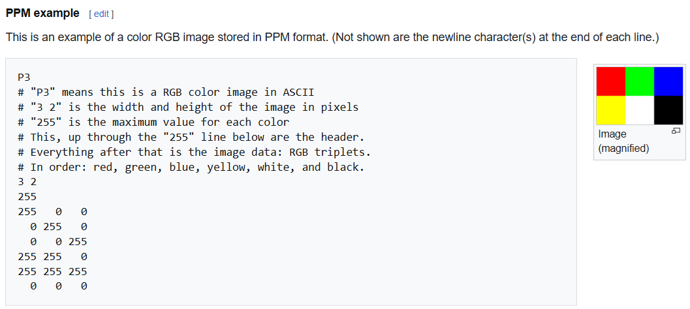
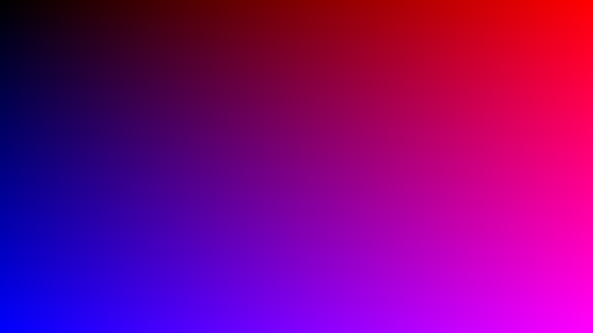
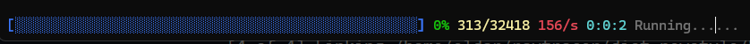
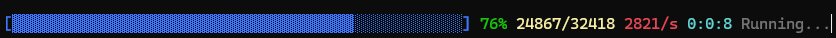
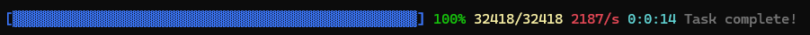
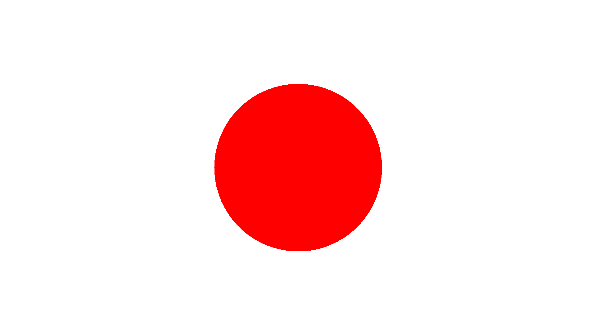
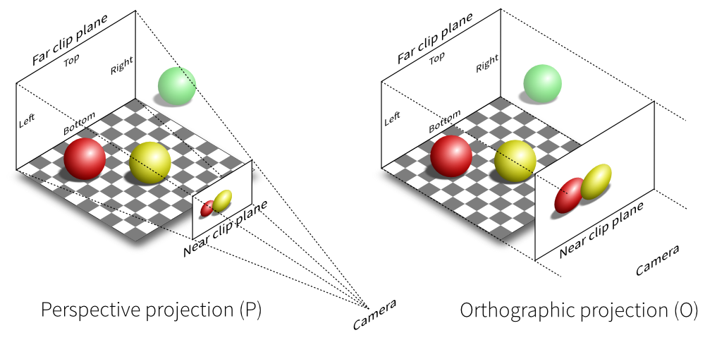
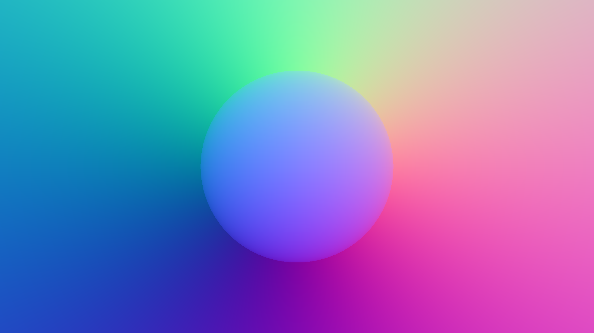
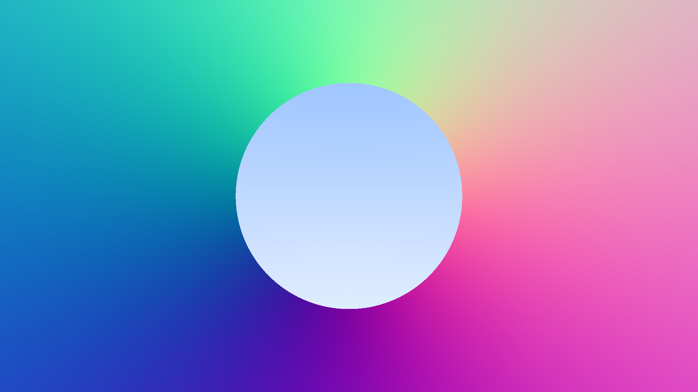
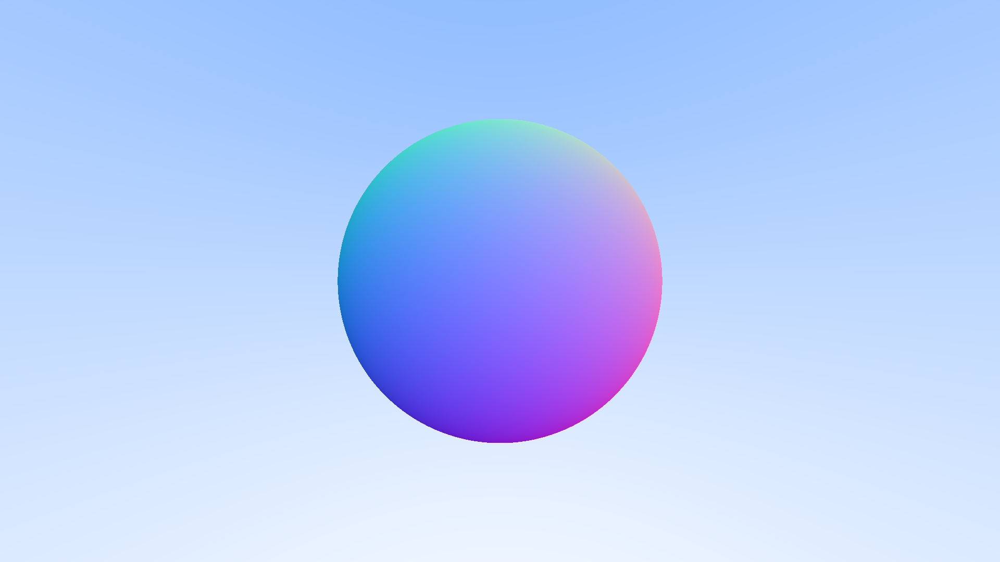

# Raytracer

A simple raytracer built with haskell (still working on it).

## Usage

Use the raytracer like this:

```
cabal run raytracer <args>
```

You have following options for the arguments:

- **No arguments**: Resolution will be set to 640x360
- **One argument `A`**: Resolution will be set to AxB, where A is your argument, and B is a value to match the 16:9 aspect ratio.
- **Two arguments `A` and `B`**: Resolution will be set to AxB, if your resolution matches the 16:9 aspect ratio. Otherwise it will cause an error.

## Progress

In this chapter, I will track the progress of the raytracer everytime I continue the work on it. I will explain why certain things are done and the technical/mathematical explanations (oversimplified) too.

### Creating an image

When we want to build a raytracer, the first thing we need is to create an image. A simple image format to create is the [ppm image format](https://de.wikipedia.org/wiki/Portable_Anymap).

<div style="text-align: center;">
    
</div>

We can use that to create a simple picture using some code:

```haskell
type Pixel = (Int, Int, Int)   -- (R,G,B)
type Row = [Pixel]
type Image = [Row]

createPPM :: Int -> Int -> Image
createPPM width height =
    [[(r, g, b) | x <- [0..width-1],
                  let r = scale x width,
                  let g = 0,
                  let b = scale y height]
                | y <- [0..height-1]]
    where
        scale val maxVal = round (((255.999 :: Double) * fromIntegral val) / fromIntegral (maxVal - 1))
```

This functions creates a picture based on a given width and height, creating a gradient from bottom left (blue) to top right (red), which looks like this:

<div style="text-align: center;">
    
</div>

This image has been created 1920x1080. I allow the user to choose a resolution by providing arguments to the raytracer:

```
cabal run raytracer 1920 1080
```

You can see this in the code in the `Main.hs`

```haskell
import ImageGenerator as IG -- ImageGenerator is an own module in this repository

main = do
    args <- getArgs -- Retrieve command-line args
    let (width, height) = parseArgs args -- parse them
    ...
    IG.createAndWriteFile filename $ IG.ppmToStr $ IG.createPPM width height
```

### Creating the Progress Bar

When building a computationally intense application like a raytracer, we excpect longer computation times. It can take forever to render complex scenes. That's why we're adding a progress bar. It gives us a clear sense that things are moving along, helps you catch if something's stuck and shows performance stats so you can see the effect of optimizations.

#### Setting Up the Progress Bar

```haskell
newProgressBar :: Int -> IO ProgressBar
newProgressBar total = do
    progressRef     <- newIORef 0.0
    messageRef      <- newIORef ""
    startTimeRef    <- newIORef =<< getMonotonicTime
    currentStepsRef <- newIORef 0
    totalStepsRef   <- newIORef total
    return $ ProgressBar progressRef messageRef startTimeRef currentStepsRef totalStepsRef
```

We need this function to set up everything for the progress bar. It tracks:

- How much progress we've made
- The total number of steps (e.g. how many rays or pixels we're calculating)
- The time we started, so we know how long we're computing.

#### Updating Progress

```haskell
updateProgress :: ProgressBar -> Int -> IO ()
updateProgress pb steps = do
    writeIORef (currentSteps pb) steps
    total <- readIORef (totalSteps pb)
    writeIORef (progress pb) (fromIntegral steps / fromIntegral total)
    renderProgressBar pb
```

Updating the progress as the raytracer does its thing. Every time certain number of steps are completed, we update how many steps are done, we calculate how for along we are (percentage) and we refresh the progress bar on the screen.

#### Rendering the bar

```haskell
renderProgressBar :: ProgressBar -> IO ()
renderProgressBar pb = do
    ... -- Read IORefs to grab progress, message, etc.
    let filled = replicate (progressPercent * 50 `div` 100) '▓'
    let empty = replicate (50 - length filled) '░'
    putStr $ "\r[" ++ filled ++ empty ++ "] " ++ show progressPercent ++ "% ..."
    hFlush stdout
```

This is where the magic happens: it takes all the data - like how for along we are, how fast it's going and how long it's been running - and renders it as a nice progress bar. We use `▓` for the filled part and `░` for the empty part, so it looks slick.

Here is a screenshot of what the bar looks like when we start the raytracer:



Here is a screenshot of what the bar looks like when it's about 3/4 done.:



And here is what it looks when the program ended:



### Vectors - The Vec3 module

The `Vec3` module is the backbone of all the 3D math we'll need in our ray tracer. It handles everything from points in space to directions, colors, and even lighting calculations.

A `Vec3` is a 3D vector with three components: `x`, `y` and `z`. It's used for points, directions and colors (RGB values for pixels). We need a bunch of vector math for a ray tracer which include:

- Addition, subtraction, scaling, dot product, cross product
- Turning any vector into a unit vector (length = 1)
- Multiplying or dividing vectors component by component (useful for colors).

Example usage of `Vec3`:

```haskell
origin :: Vec3
origin = Vec3 0 0 0

direction :: Vec3
direction = Vec3 1 2 3

rayAt :: Vec3 -> Vec3 -> Double -> Vec3
rayAt origin direction t = add origin (scale t direction)

pixelColor :: Vec3
pixelColor = normalize (Vec3 0.5 0.7 1.0)
```

You can check out the `Vec3` implementation [here](./app/Vec3.hs).

### ImageGenerator Module - Drawing circles

Later we will want to create a sphere. So lets start by doing it in 2D by changing the `createPPM`
to not do a fade, but draw a circle:

```haskell
createPPM :: Int -> Int -> Image
createPPM width height =
    [[pixelColor i j | i <- [0..width-1]] | j <- [0..height-1]]
    where
        cx = width `div` 2
        cy = height `div` 2
        radius = min cx cy `div` 2
        pixelColor i j =
            if (i - cx) ^ (2 :: Integer) + (j - cy) ^ (2 :: Integer) <= radius ^ (2 :: Integer)
                then Vec3 1.0 0.0 0.0 -- Red
                else Vec3 1.0 1.0 1.0 -- White
```

As you see, we here already use `Vec3` for the colors. Colors often require operations like addition, scaling and blending.
Since `Vec3` already supports these operations, and colors can be represented by three components, it simplifies the implementation.

With that, we can create this image with a red circle:



### The Ray Module

The `Ray` module defines a `Ray` type and provides utility functions for working with rays.

A `Ray` type is defined by its origin (a point in 3D space) and its direction (a 3D vector). Both are represented using the `Vec3` type.

```haskell
data Ray = Ray
    { origin :: Vec3
    , direction :: Vec3
    } deriving (Show)
```

The `at` function computes the point at parameter `t` along the ray.

```haskell
at :: Ray -> Double -> Vec3
at (Ray orig dir) t = orig `add` scale t dir
```

We can us it infix to improve readability. Example Usage:

```haskell
-- Define a ray
let rayOrigin = Vec3 1.0 2.0 3.0
let rayDirection = Vec3 0.0 1.0 0.0
let ray = Ray rayOrigin rayDirection

-- Compute the point at t = 2.0 using infix notation
let pointAtT = ray `at` 2.0
```

### Start the Raytracing

A ray tracer sends rays through pixels and computes the color seen in the direction of those rays. The steps are:

1. Calculate the ray from the "eye" through the pixel
2. Determine which objects the ray hits
3. Compute a color for the closest intersection point.

To start that, we need a camera in the scene.

We'll define a standard camera which is positioned at $(0, 0, 0)$. Later, we will try to move that camera
and observe what effect it has on our scene.

```haskell
defaultCamera :: Int -> Int -> Camera
defaultCamera width height =
    let aspectRatio = fromIntegral width / fromIntegral height
        viewportHeight = 2.0
        viewportWidth = viewportHeight * aspectRatio

        focalLength = 1.0

        origin = V.Vec3 0.0 0.0 0.0
        horizontal = V.Vec3 viewportWidth 0.0 0.0
        vertical = V.Vec3 0.0 viewportHeight 0.0
        lowerLeftCorner = origin `V.sub` V.scale 0.5 horizontal
                                `V.sub` V.scale 0.5 vertical
                                `V.sub` V.Vec3 0.0 0.0 focalLength
    in Camera origin lowerLeftCorner horizontal vertical
```

Now before adding a sphere, we'll change the background and get rid of the circle. For that
we change our `traceRay` function.

```haskell
traceRay :: R.Ray -> Col.Color
traceRay ray =
    let V.Vec3 _ y _ = V.normalize (R.direction ray)  -- Normalize direction
        t = 0.5 * (y + 1.0)
        white = V.Vec3 1.0 1.0 1.0
        blue  = V.Vec3 0.5 0.7 1.0
    in Col.lerp t white blue  -- Use lerp for smooth background
```

This then creates a scene background like this:


### Adding a Sphere

A sphere with a given radius $r$ centered at the origin can be described by the equation:

$$
x^2 + y^2 + z^2 = r^2
$$

If the sphere is instead centered at an arbitrary point $(C_x, C_y, C_z)$, we adjust the equation accordingly:

$$
(C_x - x)^2 + (C_y - y)^2 + (C_z - z)^2 = r^2
$$

For graphics applications, it's convenient to express this equation using vectors. If we define the center
as $C$ and any point in space as $P$, then the equation of the sphere becomes:

$$
(C - P) \cdot (C - P) = r^2
$$

This means that any point $P$ satisfying this equation lies on the sphere's surface.

A ray defined by an origin point $Q$ and a direction $d$, parameterized by $t$:

$$
P(t) = Q + td
$$

To find where the ray intersecets the sphere, we substitute $P(t)$ into the sphere equation:

$$
(C - (Q + td)) \cdot (C - (Q + td)) = r^2
$$

Expanding the expression inside the parantheses:

$$
(-td + (C - Q)) \cdot (-td + (C - Q)) = r^2
$$

Using the distributive property of the dot product:

$$
t^2d \cdot d - 2td \cdot (C - Q) + (C - Q) \cdot (C - Q) = r^2
$$

Rearranging everything to one side:

$$
t^2d \cdot d - 2td \cdot (C - Q) + (C - Q) \cdot (C - Q) - r^2 = 0
$$

The vectors and $r$ in that equation are all constant and known. The only unknown is t, and we have $t^2$, which means that
this equation is quadratic. You can solve for a quadratic equation $ax^2 + bx + c = 0$ by using the
quadratic formula:

$$
x = \frac{-b \pm \sqrt{b^2 - 4ac}}{2a}
$$

Solving for t in the ray-sphere intersection equation gives us these values for a, b and c:

$$
a = d \cdot d
$$

$$
b = -2d \cdot (C - Q) \\
$$

$$
c = (C - Q) \cdot (C - Q) - r^2
$$

Using all of the above you can solve for $t$. The term inside the square root, $b^2 - 4ac$, determines the number
of solutions:

- If it is positive, there are two solutions, meaning the ray intersects the sphere at two points.
- If it is zero, there is one solution, meaning the ray just grazes the sphere (a tangent intersection).
- If it is negative, there are no real solutions, meaning the ray misses the sphere completely.

This formulation directly translates algebraic results into geometric insights, making it extremely useful
in computer graphics for rendering, collision detection and shading calculations. All which we will need later.


If we use that we can hardcore detection for a sphere into our raytracer:

```haskell
hitSphere :: V.Vec3 -> Double -> R.Ray -> Bool
hitSphere center radius ray =
    let oc = R.origin ray `V.sub` center
        a = V.dot (R.direction ray) (R.direction ray)
        b = 2.0 * V.dot oc (R.direction ray)
        c = V.dot oc oc - radius * radius
        discriminant = b * b - 4 * a * c
    in discriminant > 0
```

We then have to update our `traceRay` function to include checking for collisions with our sphere:

```haskell
import qualified Vec3 as V
import qualified Ray as R
import qualified Sphere as S

traceRay :: R.Ray -> Col.Color
traceRay ray =
    if S.hitSphere (V.Vec3 0 0 (-1)) 0.5 ray
    then V.Vec3 1.0 0.0 0.0     -- Red color for hit
    else
        let V.Vec3 _ y _ = V.normalize (R.direction ray)  -- Normalize direction
            t = 0.5 * (y + 1.0)
            white = V.Vec3 1.0 1.0 1.0
            blue  = V.Vec3 0.5 0.7 1.0
        in Col.lerp t white blue  -- Use lerp for smooth background
```


You can watch the full rendered video [here](docs/ScreenView.mp4).

This procedure on our screen then generates following image showing a sphere in 2D, which here just looks like the circle from before:


**Perspective Projection**

If we shoot out rays parallel to each other straight into the scene, we do not get correct perspective projection for the objects within the scene. Meaning two identical objects, one close to the camera and one further away, will look the exact same size.

The key idea for solving that: Rays Diverge from the Camera Origin.

So in our code, we'll have to make our rays not parallel, but spread out from the camera's origin.

1. The camera defines a viewport

    ```haskell
    lowerLeftCorner = origin `V.sub` V.scale 0.5 horizontal
                            `V.sub` V.scale 0.5 vertical
                            `V.sub` V.Vec3 0.0 0.0 focalLength
    ```

    This sets up the bottom-left of a 2D screen in front of the camera. The viewport is centered at `z = -focalLength`, meaning it's in front of the camera. `horizontal` and `vertical` define the size of this screen.

2. Each Ray Points at a Different Pixel

    In `generateRay`:

    ```haskell
    let u = fromIntegral i / fromIntegral (width - 1)
    v = fromIntegral j / fromIntegral (height - 1)
    ```

    `u` and `v` define the position of the pixel in the viewport, where

    - `u = 0` is the leftmost pixel, `u = 1` is the rightmost.
    - `v = 0` is the bottom pixel, `v = 1` is the top.

    Then the ray's direction is computed:

    ```haskell
    direction = (lowerLeftCorner camera `V.add`
             V.scale u (horizontal camera) `V.add`
             V.scale v (vertical camera))
            `V.sub` origin camera
    ```

    This means the ray's direction is from the camera origin to a specific pixel on the viewport. Since the viewport is in front of the camera at `z = -1.0`, the farther pixels are at larger `z` values.

**Why this causes objects to look smaller in distance**: Rays spread out from a single point (the camera origin). Unlike orthographic projection, these rays fan out from $(0,0,0)$. Distant objects get fewer rays per unit of their surface, meaning less pixels are covered by them.


_[Source: stackoverflow.com](https://stackoverflow.com/questions/36573283/from-perspective-picture-to-orthographic-picture)_

### Surface Normals and Multiple Objects

A surface normal is a vector that sticks straight out from the surface of an object at a specific point.
Imagine you standing on earth: The surface normal would point exactly upwards from your position. The normal is important because it helps us figure out how light interacts with the surface, which is crucial for shading and making objects look realistic.


**There are a few decisions to make with normals:**

A unit-length vector is a vector that has a length of exactly 1. We need to decide whether our normal vectors
should always be unit length or if they can have any length. Here's why unit-length normals are a good idea:

1. **Efficiency**: If we need a unit-length normal later (and we often do), it's better to normalize it once upfront rather than doing it repeatedly every time it's needed.
2. **Common Use Case**: Many calculations in graphics (like lighting) require unit-length normals. If we make them unit length from the start, we avoid extra work later.
3. **Geometry-Specific Optimization**: For some shapes (like spheres), we can calculate unit-length normals very efficiently without doing expensive math like square roots.

So the decision is: all normal vectors in our code will be unit length. We can see this here in the code:

```haskell
let normal = V.normalize (V.sub (R.at ray t) (V.Vec3 0 0 (-1))) -- normal is normalized (to unit length)
```

**Visualizing Normals with Colors**

Since we don't have lights or shading yet, we can visualize the normals by turning them into colors. Here's how it works:

- A normal vector has three components: x, y, z. Each component is a number beteween -1 and 1 (because the vector is unit length).
- We can map these components to colors: x = red, y = green, z = blue
- Since colors are usually represented as values between 0 and 1, we adjust the normal component to fit this range. For example if the normal is $(0.5, -0.5, 1)$, we map it to $(0.75, 0.25, 1)$ for the color.

This gives us a colorful representation of the normals, which helps us see how they change across the surface of an object.

**Sphere normals**

For a sphere centered at the origin with radius $r$, the normal at a hit point **P** is simply:

$$
\text{normal} = \frac{P - \text{center}}{r}
$$

Since the center is at the origin, this simplifies to:

$$
\text{normal} = \frac{\text{P}}{r}
$$

This avoids the need for a square root, making it efficient.

**Why we do this**

By visualizing normals, we can debug our code and ensure that the normals are being calculated correctly. Once we add lights and shading, these normals will determine how the surface will light, making the object look realistic.

**Using surface normals to color map our sphere:**

So while trying to start with the shading of objects, I tried to generate a color map of the
surface normals on the sphere. While doing that, I accidentally created the following two images.

Generation with multiple issues |  Generation (inverted hit detection)
:-------------------------:|:-------------------------:
  |  

After correcting the mistakes, I got following image:



**Move Sphere further away**: Using the implemented perspective projection we can move the sphere further back to $(0,0,-5)$. Which then would look like this:


But for now, we'll keep it at $(0,0,-1)$.

### Simplifying the Ray-Sphere Intersection Code

Lets simplify the ray-sphere function:

```haskell
hitSphere :: V.Vec3 -> Double -> R.Ray -> Double
hitSphere center radius ray
    | discriminant < 0 = -1.0
    | t1 > 0.0 = t1
    | t2 > 0.0 = t2
    | otherwise = -1.0
    where 
        oc = R.origin ray `V.sub` center
        a = V.dot (R.direction ray) (R.direction ray)
        b = 2.0 * V.dot (R.direction ray) oc
        c = V.dot oc oc - radius * radius
        discriminant = b * b - 4 * a * c
        sqrtD = sqrt discriminant
        t1 = (-b - sqrtD) / (2.0 * a)  -- Closer intersection
        t2 = (-b + sqrtD) / (2.0 * a)  -- Farther intersection
```

A vector dotted with itself is equal to the squared length of that vector. The equation for $b$ has a factor of negative two in it. Consider what happens to the quadratic equation if $b = -2h$:

$$
\frac{-b \pm \sqrt{b^2 - 4ac}}{2a}
$$

$$
= \frac{-(-2h) \pm \sqrt{(-2h)^2 - 4ac}}{2a}
$$

$$
= \frac{2h \pm 2 \sqrt{h^2 - ac}}{2a}
$$

$$
= \frac{h \pm \sqrt{h^2 - ac}}{a}
$$

Solving for h, we get:

$$
h = \frac{b}{-2} = d \cdot (C - Q)
$$

Which turns into this new implementation for the `hitSphere` function:

```haskell
hitSphere :: V.Vec3 -> Double -> R.Ray -> Double
hitSphere center radius ray
    | discriminant < 0 = -1.0
    | otherwise = (-h - sqrt discriminant) / a
    where 
        oc = R.origin ray `V.sub` center
        a = V.lengthSquared $ R.direction ray
        h = V.dot oc $ R.direction ray
        discriminant = h * h - a * (V.lengthSquared oc - radius * radius)
```

In this implementation, the `hitSphere` function has been optimized to improve performance:

1. Substitution of `h`:
    Instead of calculating `b = 2.0 * V.dot oc $ R.direction ray`, we compute `h = V.dot oc $ R.direction ray`, which is equivalent to `b / 2`. This simplifies the discriminant calculation to:
    ```haskell
    discriminant = h * h - a * c
    ```
2. Simplified Intersection Calculation:
    The intersection parameter `t` is now calculated as:
    ```haskell
    t = (-h - sqrt discriminant) / a
    ```
    This voids the division by `2.0 * a`, further reducing the number of operations.


By reducing the number of multiplications and divisions, this version is more efficient. This is critical for ray tracing, where the `hitSphere` function can be called millions of times depending on the scene.


### Profiling

cabal.project.local file:

```
package *
  profiling: True
```
then

`cabal clean`

then 

`cabal build --enable-profiling`

then `cabal run profraytracer 1920 1080 -- +RTS -p`

coming.

```
	Mon Feb 24 23:23 2025 Time and Allocation Profiling Report  (Final)

	   profraytracer +RTS -p -RTS 1920 1080

	total time  =        2.15 secs   (2152 ticks @ 1000 us, 1 processor)
	total alloc = 7,983,032,104 bytes  (excludes profiling overheads)

COST CENTRE                     MODULE                   SRC                                             %time %alloc

ppmToStr.pixelData              Rendering.ImageGenerator app/Rendering/ImageGenerator.hs:53:9-65          28.6   36.7
ppmToStr.showPixel              Rendering.ImageGenerator app/Rendering/ImageGenerator.hs:(58,9)-(59,86)   14.7   24.9
generateRay                     Rendering.Camera         app/Rendering/Camera.hs:(37,1)-(44,52)            9.6   12.7
createAndWriteFile              Rendering.ImageGenerator app/Rendering/ImageGenerator.hs:63:1-30           9.4    0.1
generateRay.direction           Rendering.Camera         app/Rendering/Camera.hs:(40,9)-(43,41)            7.3    1.2
traceRay                        Rendering.ImageGenerator app/Rendering/ImageGenerator.hs:(34,1)-(44,41)    6.9    7.5
hit                             Hittable.Objects.Sphere  app/Hittable/Objects/Sphere.hs:(13,5)-(29,47)     5.9    0.5
lerp                            Rendering.Color          app/Rendering/Color.hs:14:1-58                    4.4    4.8
hit.oc                          Hittable.Objects.Sphere  app/Hittable/Objects/Sphere.hs:19:13-47           3.1    2.5
createPPM                       Rendering.ImageGenerator app/Rendering/ImageGenerator.hs:(25,1)-(31,27)    1.7    3.5
createPPM.pixelColor.ray        Rendering.ImageGenerator app/Rendering/ImageGenerator.hs:30:17-61          1.4    2.1
hit.discriminant                Hittable.Objects.Sphere  app/Hittable/Objects/Sphere.hs:22:13-89           1.2    0.4
hit.makeHitRecord.outwardNormal Hittable.Objects.Sphere  app/Hittable/Objects/Sphere.hs:28:21-89           1.1    0.8
```

### An Abstraction for Hittable Objects

next up.