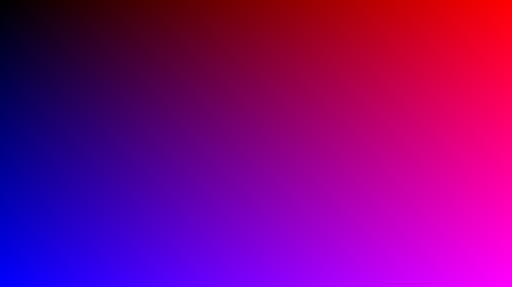

# Chapter 1: Creating the Image

When building a raytracer, the first step is to generate an image. A simple and human-readable format is the [PPM image format](https://de.wikipedia.org/wiki/Portable_Anymap). It allows us to directly write pixels to a file without needing an image library.


### 🔧 Writing Pixels to PPM

We represent an image as a 2D grid of RGB pixels:

```haskell
type Pixel = (Int, Int, Int)   -- (R, G, B)
type Row = [Pixel]
type Image = [Row]
```

We can then create an image with a hoizontal-red and vertical-blue gradient:

```haskell
createPPM :: Int -> Int -> Image
createPPM width height =
    [[(r, g, b) | x <- [0..width-1],
                  let r = scale x width,
                  let g = 0,
                  let b = scale y height]
                | y <- [0..height-1]]
  where
    scale val maxVal =
      round (((255.999 :: Double) * fromIntegral val) / fromIntegral (maxVal - 1))

```

This will generate a simple image fading from blue (bottom-left) to red (top-right).


