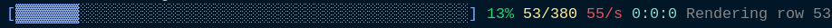

[🔗 Back to Chapters](/README.md#-chapters)

# Chapter 2: Creating the Progress Bar

When building a computationally intense application like a raytracer, we expect longer computation times. It can take a while to render complex scenes.

That’s why we’re adding a **progress bar**. It gives us a clear sense that things are moving along, helps detect if something is stuck, and shows performance stats so we can observe the effect of optimizations.

---

## 🏗️ Setting Up the Progress Bar

We initialize the progress bar with this function:

```haskell
newProgressBar :: Int -> IO ProgressBar
newProgressBar total = do
    progressRef     <- newIORef 0.0
    messageRef      <- newIORef ""
    startTimeRef    <- newIORef =<< getMonotonicTime
    currentStepsRef <- newIORef 0
    totalStepsRef   <- newIORef total
    return $ ProgressBar progressRef messageRef startTimeRef currentStepsRef totalStepsRef
```

This sets up everything we need to track progress:

- `progress`: How far we are (0.0 to 1.0)
- `currentSteps` / `totalSteps`: Tracks how many rays/pixels we've calculated
- `startTime`: For elapsed time and performance stats
- `message`: Optional status message to display

## Updating Progress

As the raytracer runs, we update the progress bar:

```haskell
updateProgress :: ProgressBar -> Int -> IO ()
updateProgress pb steps = do
    writeIORef (currentSteps pb) steps
    total <- readIORef (totalSteps pb)
    writeIORef (progress pb) (fromIntegral steps / fromIntegral total)
    renderProgressBar pb
```

This function:

- Updates the number of completed steps
- Computes the current progress (as a percentage)
- Triggers a re-render of the progress bar

## Rendering the Progress Bar

Here's how we visually display the progress:

```haskell
renderProgressBar :: ProgressBar -> IO ()
renderProgressBar pb = do
    ... -- Read IORefs to grab progress, message, etc.
    let filled = replicate (progressPercent * 50 `div` 100) '▓'
    let empty = replicate (50 - length filled) '░'
    putStr $ "\r[" ++ filled ++ empty ++ "] " ++ show progressPercent ++ "% ..."
    hFlush stdout
```

We use `▓` for the filled portion and `░` for the unfilled portion. This creates a clean and responsive terminal UI element.



<div style="display: flex; justify-content: space-between;">
  <a href="./01_image.md">← All Chapters</a>
  <a href="./03_vec3.md">Next Chapter →</a>
</div>
