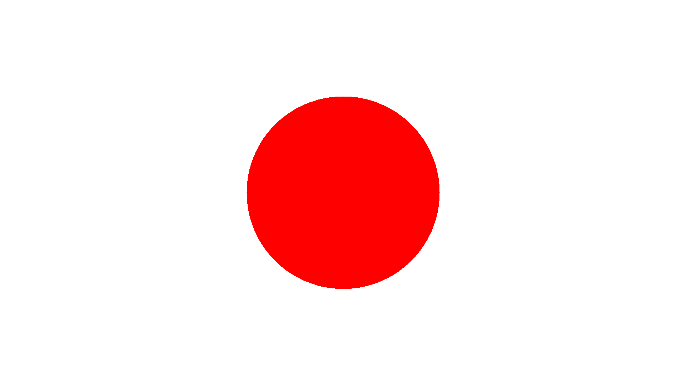

[🔗 Back to Chapters](/README.md#-chapters)

# Chapter : Drawing a Circle

Before we jump into real ray-sphere intersections in 3D, it helps to start with something simpler — a 2D circle. This lets us get a feel for shape generation and rendering logic using pure image-space math.

Instead of fading the image with a gradient like we did earlier, we now want to draw a simple red circle onto a white background. We modify our `createPPM` function for this:

```haskell
createPPM :: Int -> Int -> Image
createPPM width height =
    [[pixelColor i j | i <- [0..width-1]] | j <- [0..height-1]]
  where
    cx = width `div` 2
    cy = height `div` 2
    radius = min cx cy `div` 2
    pixelColor i j =
      if (i - cx) ^ (2 :: Integer) + (j - cy) ^ (2 :: Integer) <= radius ^ (2 :: Integer)
      then Vec3 1.0 0.0 0.0 -- Red
      else Vec3 1.0 1.0 1.0 -- White
```

This draws a red circle by checking whether a given pixel `(i, j)` lies within a given radius from the image center. If it does, it’s red; otherwise, it’s white.

What's especially nice here is that we're already using `Vec3` to represent our color - even though this is just a 2D example. Colors often require operations like addition, scaling or blending. Since `Vec3` already supports these, and since a color is essentially three values (R, G, B), it fits naturally.

Here's what the rendered circle looks like:



This might feel very basic, but it's an important foundation. Before diving into the math-heavy 3D ray-sphere intersections, this gives us a first "shape" and lets us think in terms of pixels, colors, and coordinate spaces. It also ties rendering logic to conditions over space, which will be at the heart of every object we render moving forward.

<div align="center">
  <a href="./03_vec3.md">← All Chapters</a>
  <a href="./05_ray.md">Next Chapter →</a>
</div>
