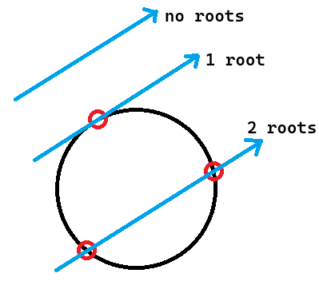
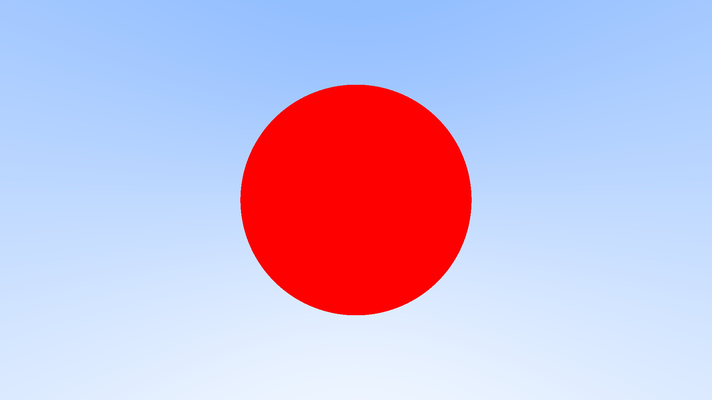

[🔗 Back to Chapters](/README.md#-chapters)

# Chapter 7: Sphere Intersection

Now that we have a camera and background gradient, it’s time to add a real object to the scene — a sphere. This introduces the first meaningful geometric intersection: determining whether a ray hits a sphere and where.

## 🧮 Sphere Equation

A sphere with a given radius $r$ centered at the origin can be described by the equation:

$$
x^2 + y^2 + z^2 = r^2
$$

If the sphere is instead centered at an arbitrary point $(C_x, C_y, C_z)$, we adjust the equation accordingly:

$$
(C_x - x)^2 + (C_y - y)^2 + (C_z - z)^2 = r^2
$$

For graphics applications, it's convenient to express this equation using vectors. If we define the center
as $C$ and any point in space as $P$, then the equation of the sphere becomes:

$$
(C - P) \cdot (C - P) = r^2
$$

This means that any point $P$ satisfying this equation lies on the sphere's surface.

A ray defined by an origin point $Q$ and a direction $d$, parameterized by $t$:

$$
P(t) = Q + td
$$

To find where the ray intersecets the sphere, we substitute $P(t)$ into the sphere equation:

$$
(C - (Q + td)) \cdot (C - (Q + td)) = r^2
$$

Expanding the expression inside the parantheses:

$$
(-td + (C - Q)) \cdot (-td + (C - Q)) = r^2
$$

Using the distributive property of the dot product:

$$
t^2d \cdot d - 2td \cdot (C - Q) + (C - Q) \cdot (C - Q) = r^2
$$

Rearranging everything to one side:

$$
t^2d \cdot d - 2td \cdot (C - Q) + (C - Q) \cdot (C - Q) - r^2 = 0
$$

The vectors and $r$ in that equation are all constant and known. The only unknown is t, and we have $t^2$, which means that
this equation is quadratic. You can solve for a quadratic equation $ax^2 + bx + c = 0$ by using the
quadratic formula:

$$
x = \frac{-b \pm \sqrt{b^2 - 4ac}}{2a}
$$

Solving for t in the ray-sphere intersection equation gives us these values for a, b and c:

$$
a = d \cdot d
$$

$$
b = -2d \cdot (C - Q) \\
$$

$$
c = (C - Q) \cdot (C - Q) - r^2
$$

Using all of the above you can solve for $t$. The term inside the square root, $b^2 - 4ac$, determines the number
of solutions:

- If it is positive, there are two solutions, meaning the ray intersects the sphere at two points.
- If it is zero, there is one solution, meaning the ray just grazes the sphere (a tangent intersection).
- If it is negative, there are no real solutions, meaning the ray misses the sphere completely.

This formulation directly translates algebraic results into geometric insights, making it extremely useful
in computer graphics for rendering, collision detection and shading calculations. All which we will need later.



## 🔍 Code: First Intersection Test

We start with a simple hit check:

```haskell
hitSphere :: V.Vec3 -> Double -> R.Ray -> Bool
hitSphere center radius ray =
    let oc = R.origin ray `V.sub` center
        a = V.dot (R.direction ray) (R.direction ray)
        b = 2.0 * V.dot oc (R.direction ray)
        c = V.dot oc oc - radius * radius
        discriminant = b * b - 4 * a * c
    in discriminant > 0
```

We then modify the `traceRay` function to return red if a sphere is hit:

```haskell
traceRay :: R.Ray -> Col.Color
traceRay ray =
    if S.hitSphere (V.Vec3 0 0 (-1)) 0.5 ray
    then V.Vec3 1.0 0.0 0.0     -- Red color for hit
    else
        let V.Vec3 _ y _ = V.normalize (R.direction ray)
            t = 0.5 * (y + 1.0)
            white = V.Vec3 1.0 1.0 1.0
            blue  = V.Vec3 0.5 0.7 1.0
        in Col.lerp t white blue
```

## 🎞️ Full View: Ray Tracing in Action


> You can also watch the full rendered video: [ScreenView.mp4](./media/07/ScreenView.mp4)

This renders a red sphere against a smooth background gradient.

The resulting image looks like this:



This step introduces how rays interact with real objects. Every feature we build from here on will be based on the idea of:

- Shooting a ray
- Determining if it hits something
- Using that hit info to compute color

We've now done this for a simple red sphere. The rest of our raytracer will build on this logic.

<div align="center">
  <a href="./06_camera.md">← Previous Chapter</a>&nbsp;&nbsp;&nbsp;&nbsp;&nbsp;
  <a href="./08_normals_and_perspective.md">Next Chapter →</a>
</div>
