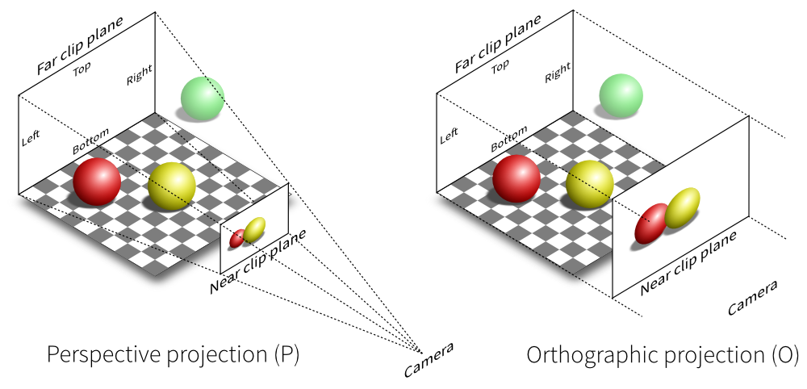

[🔗 Back to Chapters](/README.md#-chapters)

# Chapter 8: Surface Normals, Multiple Objects and Perspective Projection

A **surface normal** is a vector that sticks straight out from the surface of an object at a given point. Imagine you're standing on Earth: the normal would point directly upward from your position.

Normals are essential for lighting. They determine how light reflects, scatters, or gets absorbed — without them, there's no shading or sense of depth.

Here’s what surface normals look like for a sphere:


## 📐 Normals and Vector Length

We now have to make a decision: Should our normal vectors always be unit length?

The answer: **Yes**. Unit-length normals (i.e. vectors with length = 1) simplify lighting calculations. Normalizing once upfront is more efficient than doing it every time. For spheres, we can compute unit normals directly, without expensive square roots.

Here's what that looks like in code:

```haskell
let normal = V.normalize (V.sub (R.at ray t) (V.Vec3 0 0 (-1)))
```

This takes the hit point (computed using `R.at ray t`) and subtracts the sphere's center. The result points outward - and then we normalize it to unit length.

## 🎨 Coloring Normals

Before we add lights and materials, we visualize normals using color. Why? Because each normal is a direction vector with `(x, y, z)` values between `-1` and `1`, and those can be mapped to RGB:

- `x`: Red
- `y`: Green
- `z`: Blue

But since color components usually range from `0` to `1`, we remap by doing:

```haskell
color = 0.5 * (normal + 1.0)
```

This shifts the normal range from `[-1, 1]` to `[0, 1]`, allowing direct color mapping.

For a sphere centered at the origin, the normal at point `P` is simply:

```haskell
normal = (P - center) / r
```

If the sphere is at the origin and `r = 1`, it simplifies to just:

```haskell
normal = P
```

## Resulting Images

While trying to render normals visually, I ran into a few bugs, creating these images:

| Generation with multiple issues | Generation (inverted hit detection) |
| :-----------------------------: | :---------------------------------: |
|      |         |

After fixing the math, I got the following correct result:


## 🔭 Perspective Projection

If we shoot out rays parallel to each other straight into the scene, we do not get correct perspective projection for the objects within the scene. Meaning two identical objects, one close to the camera and one further away, will look the exact same size.

The key idea for solving that: Rays Diverge from the Camera Origin.

So in our code, we'll have to make our rays not parallel, but spread out from the camera's origin.

1. The camera defines a viewport

   ```haskell
   lowerLeftCorner = origin `V.sub` V.scale 0.5 horizontal
                           `V.sub` V.scale 0.5 vertical
                           `V.sub` V.Vec3 0.0 0.0 focalLength
   ```

   This sets up the bottom-left of a 2D screen in front of the camera. The viewport is centered at `z = -focalLength`, meaning it's in front of the camera. `horizontal` and `vertical` define the size of this screen.

2. Each Ray Points at a Different Pixel

   In `generateRay`:

   ```haskell
   let u = fromIntegral i / fromIntegral (width - 1)
   v = fromIntegral j / fromIntegral (height - 1)
   ```

   `u` and `v` define the position of the pixel in the viewport, where

   - `u = 0` is the leftmost pixel, `u = 1` is the rightmost.
   - `v = 0` is the bottom pixel, `v = 1` is the top.

   Then the ray's direction is computed:

   ```haskell
   direction = (lowerLeftCorner camera `V.add`
            V.scale u (horizontal camera) `V.add`
            V.scale v (vertical camera))
           `V.sub` origin camera
   ```

   This means the ray's direction is from the camera origin to a specific pixel on the viewport. Since the viewport is in front of the camera at `z = -1.0`, the farther pixels are at larger `z` values.

**Why this causes objects to look smaller in distance**: Rays spread out from a single point (the camera origin). Unlike orthographic projection, these rays fan out from $(0,0,0)$. Distant objects get fewer rays per unit of their surface, meaning less pixels are covered by them.


_[Source: stackoverflow.com](https://stackoverflow.com/questions/36573283/from-perspective-picture-to-orthographic-picture)_

---

Using our perspective camera, we can now start exploring depth. A good first step is to move the sphere back in the scene — from `(0, 0, -1)` to `(0, 0, -5)`.

With our ray generation in place, this small change visually shrinks the object due to perspective projection — rays diverge as they move away from the camera, so distant objects appear smaller.

Here’s the result:


This also confirms that our rays are behaving as expected — spreading from a single origin, intersecting the image plane, and correctly projecting 3D space into 2D.
