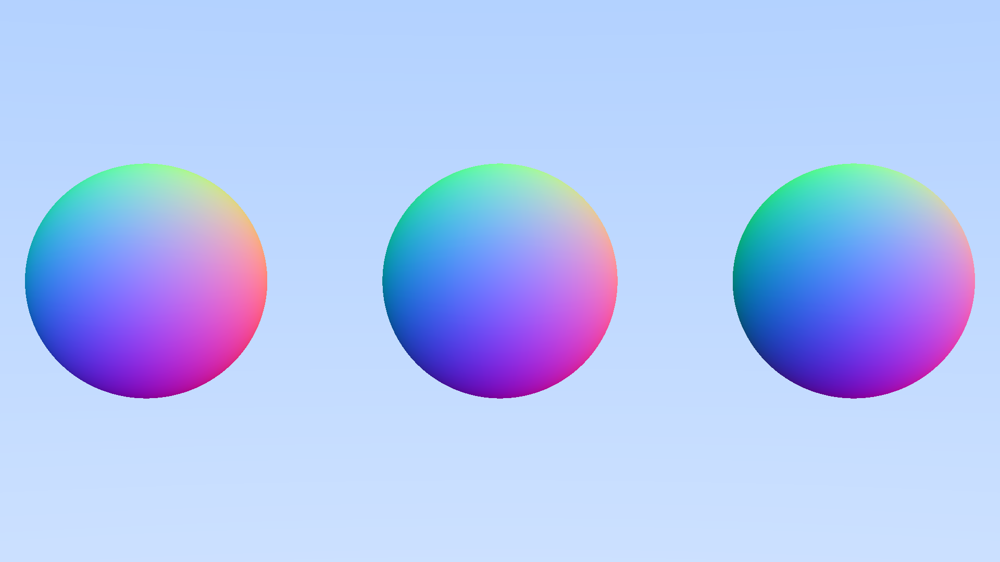

[🔗 Back to Chapters](/README.md#-chapters)

# Chapter 12: Fixing Perspective Distortion

After rendering our first multi-object scenes, we began to notice a subtle problem: objects near the edge of the screen appear **stretched** or **distorted**. This is a common issue in perspective projection and it needs to be addressed.

## 🌍 The Problem: Perspective Distortion

If our viewport (image plane) is too close to the camera, the rays diverge too quickly. This creates a **wide-angle effect**, where objects near the edge appear warped.

Why this happens:

- All rays originate from the camera (at the origin)
- If the virtual screen is very close, the rays fan out at steep angles
- As a result, pixels near the edge of the image correspond to wide-angle views

We want to reduce this distortion and create a more natural perspective.

## 🔄 The Fix: Focal Length & Camera Position

We update our camera definition by increasing the **focal length** (which pushes the screen away), and **move the camera back** to compensate.

```haskell
defaultCamera :: Int -> Int -> Camera
defaultCamera width height =
    let aspectRatio = fromIntegral width / fromIntegral height
        viewportHeight = 2.0
        viewportWidth = viewportHeight * aspectRatio

        focalLength = 5.0

        cOrigin = V.Vec3 0.0 0.0 5.0
        cHorizontal = V.Vec3 viewportWidth 0.0 0.0
        cVertical = V.Vec3 0.0 viewportHeight 0.0
        cLowerLeftCorner = cOrigin `V.sub` V.scale 0.5 cHorizontal
                                  `V.sub` V.scale 0.5 cVertical
                                  `V.sub` V.Vec3 0.0 0.0 focalLength
    in Camera cOrigin cLowerLeftCorner cHorizontal cVertical
```

### Breakdown:

- `focalLength = 5.0` pushes the image plane further away from the camera
- `cOrigin = (0,0,5)` moves the camera back, so the scene stays visible
- This setup narrows the field of view and fixes the stretching

## 🎨 Result: Cleaned Up Image

With this camera setup, the rays diverge more slowly. Objects now appear with correct proportions, even at the edges.



## 🪖 Summary

- Perspective distortion occurs when the field of view is too wide
- Increasing the focal length narrows the view
- Moving the camera back compensates and centers the scene

Together, these steps make the perspective feel more realistic and consistent.

<div align="center">
  <a href="./11_multiple_objects.md">← Previous Chapter</a>&nbsp;&nbsp;&nbsp;&nbsp;&nbsp;
  <a href="./13_front_vs_backfaces.md">Next Chapter →</a>
</div>
