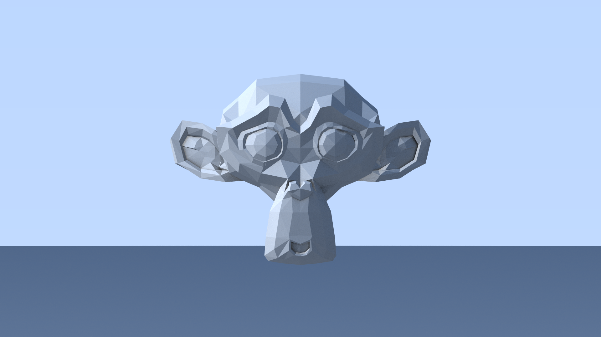

[🔗 Back to Chapters](/README.md#-chapters)

# Chapter 19: Monkey Render

After adding .obj file support and implementing acceleration structures, it was time to try rendering a proper 3D model. The go-to test subject: **Blender's Suzanne monkey**.

Suzanne is a classic benchmark mesh — simple yet detailed enough to reveal raytracing bugs, performance issues, and shading artifacts.


## 📖 Importing the Model

The monkey model was exported from Blender as a `.obj` file containing roughly **1000 triangles**.

We parsed the file using our custom OBJ loader and converted the triangles into hittable objects:

```haskell
loadObj :: FilePath -> Vec3 -> IO [Triangle]
```

The triangles were optionally offset (e.g. moving the model up or back in the scene), then placed into a `BVHNode`.


## 🚀 BVH Acceleration

To handle the large number of triangles efficiently, we inserted them into a Bounding Volume Hierarchy (BVH). This reduces ray-triangle intersection checks from O(n) to O(log n).

The monkey render was tested with various BVH settings:

- BVH depth 10
- BVH depth 32
- Heuristic for sorting along longest axis
- Child ordering based on hit distance

All of this is configurable in the config file.


## 🔢 Configuration Snippet

```json
"scene": {
  "models": [
    {
      "file": "models/monkey.obj",
      "position": [0, 0, 0]
    }
  ]
},
"bvh": {
  "enabled": true,
  "maxDepth": 10
}
```


## 🎨 Final Render

The monkey was rendered at:

- Resolution: 1920x1080
- Samples per pixel: 50
- Approx. 1000 triangles

### Before BVH (no acceleration)

**Render Time**: 42 minutes 04 seconds

### After BVH-10

**Render Time**: 1 minute 44 seconds

